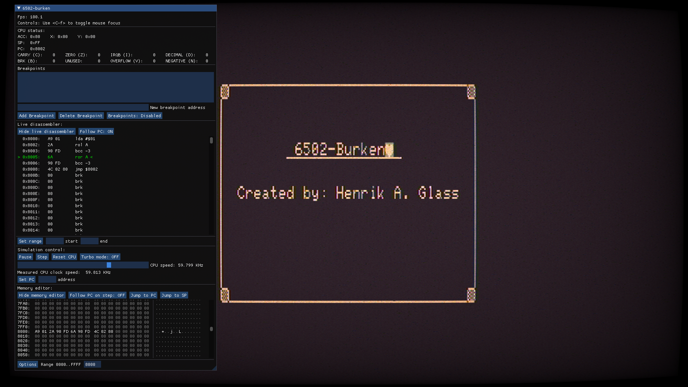

# 6502-burken
A WIP computer emulation based on the MOS Technology 6502 cpu.

The 6502-burken user interface and interactive debugger.

# Credits
This project uses open source components, listed below.

Tom Harte's ProcessorTests: https://github.com/TomHarte/ProcessorTests
Niels Lohmann's json: https://github.com/TomHarte/ProcessorTests

TODO

